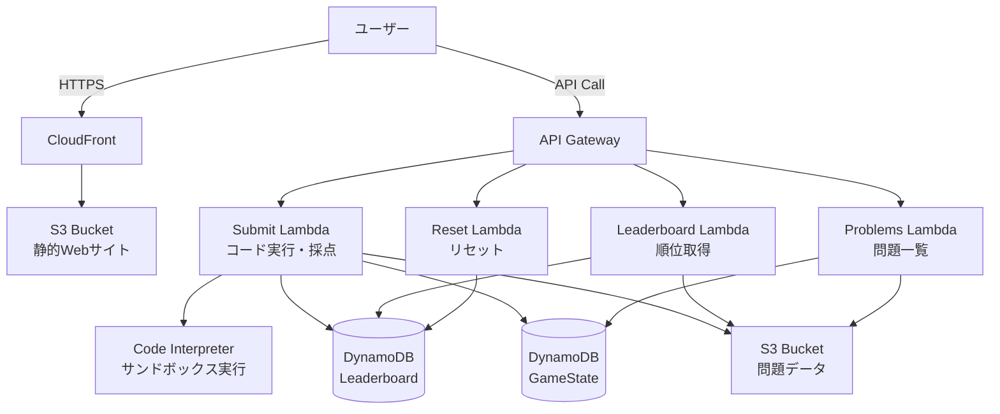
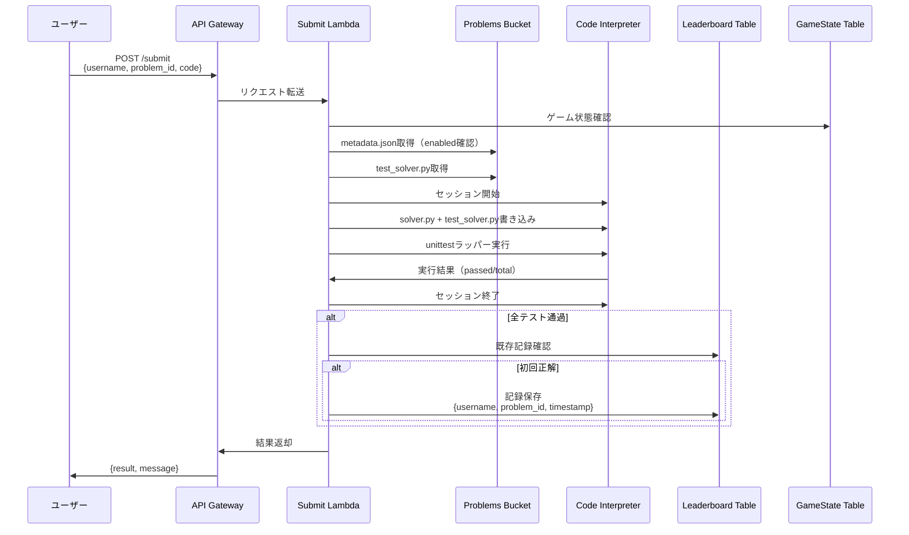
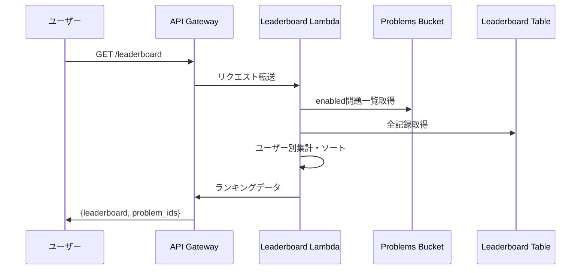

# Code Interpreter Coding Contest

Code Interpreter Coding Contestは、様々な問題をコーディングコンテスト・タイムアタック形式で競い合うためのサーバーレスプラットフォームです。

Amazon Bedrock AgentCore Code Interpreterを活用したサンドボックスでの安全なコード実行環境、リアルタイムリーダーボード、RESTful APIを提供し、AI駆動のコーディングコンテストを簡単に開催できます。

## 主な機能

- **安全なコード実行**: Amazon Bedrock AgentCore Code Interpreterによるサンドボックス環境でのPythonコード実行
- **リアルタイムリーダーボード**: CloudFront + S3でホストされる自動更新型のWebインターフェース
- **RESTful API**: コード提出、順位取得、ゲーム状態管理のためのAPI Gateway統合
- **カスタマイズ可能な問題セット**: ディレクトリベースの問題定義で簡単に問題を追加・編集可能
- **Basic認証**: 管理画面へのアクセス制御

## 問題定義

各問題は `contents/` 配下のディレクトリとして定義します:

```
contents/
├── bracket-depth/
│   ├── metadata.json      # タイトル、説明、表示順、有効/無効
│   ├── solver.py           # 正解コード（参照実装、デプロイしない）
│   └── test_solver.py      # unittest形式のテストケース（採点に使用）
├── country-quiz/
│   ├── metadata.json
│   ├── solver.py
│   ├── test_solver.py
│   └── assets/             # 画像等の静的アセット
│       └── country.jpg
└── ...
```

- ディレクトリ名がそのまま問題ID（`problem_id`）になります
- `solver.py` はローカル検証専用で、デプロイされません
- `test_solver.py` は `unittest` 形式で、Code Interpreter上で採点に使用されます

### ローカル検証

```bash
uv run python -m pytest contents/<problem-name>/test_solver.py -v --rootdir=contents/<problem-name>
```

## デプロイ

```bash
uv sync
uv run cdk bootstrap  # 初回のみ
uv run cdk deploy -c adminUsername=<ユーザー名> -c adminPassword=<セキュアなパスワード>
```

## 使用方法

詳細はRUNBOOK.mdをご参照ください。

## アーキテクチャ



## データフロー

### コード提出フロー


### リーダーボード取得フロー


## Security

See [CONTRIBUTING](CONTRIBUTING.md#security-issue-notifications) for more information.

## License

This library is licensed under the MIT-0 License. See the LICENSE file.
